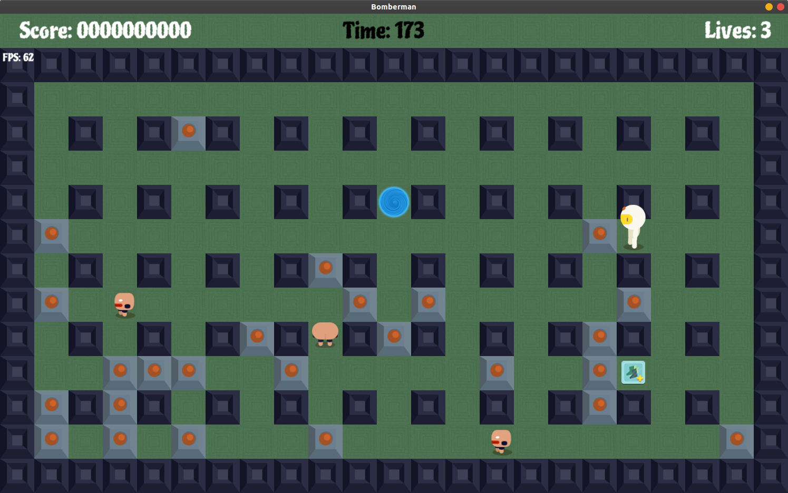

# Bomberman
Autor: Jaroslav Fikar

# Téma z Progtestu

Klasická hra Bomberman

###Implementujte následující varianty:

    1. pro alespoň 2 hráče na jednom počítači
    2. pro hru proti počítači
###Hra musí splňovat následující funkcionality:

    1. Načítání herních levelů (mapy) ze souboru (vytvořte vhodný formát)
    2. Sbírání konfigurovatelných bonusů (zvětšení plamenu, více bomb, odpalování bomb na dálku,...)
    3. Ukládání nejlepšího dosaženého skóre do souboru
###Kde lze využít polymorfismus? (doporučené)

    - Ovládání hráčů: lokální hráč, umělá inteligence (různé druhy), síťový hráč
    - Uživatelské rozhraní: konzolové, ncurses, SDL, OpenGL (různé druhy),...
    - Efekty bonusů a nemocí: zvětšení plamenu, zvýšení počtu bomb,...
Další informace

    - https://en.wikipedia.org/wiki/Bomberman

## Zadání hry
Uživatel hru spustí a pomocí grafického rozhraní bude ovládat celou aplikaci.
Hra obsahuje hlavní menu, nastavení a hlavní herní scény.
Pravidla hry se budou inpirovat původní hrou, ale nebude se jednat o přímou kopii.
Úkolem hráče je projít všechny levely co nejrychleji (a v daném časovém limitu) a získat přitom 
co nejvíce bodů (například zabitím příšer, ničením zdí a sbíráním bonusů). 
Hráč má omezený počet životů a po jejich vyčerpání hra končí.
Hlavní hráčovou schopností je pokládání a odpalování bomb. Pomocí bomb může ničit některé zdi 
a zabíjet nepřátele.
Ničením zdí si také může zpřístupnit bonusy, které mu odemknou různé výhody (např. odpalování bomb 
na dálku, více životů...).
Jednotlivé herní levely budou čteny ze souborů, které budou obsahovat všechny informace o daném levelu 
(generované bonusy, spawnované příšery...) 
Pro celou hru bude jedna mapa, která se skládá z nezničitelných zdí. Ta bude načítána ze souboru. 
Zničitelné zdi budou generovány náhodně.

Hru bude možné hrát ve dvou (třech) režimech:
   1. Singleplayer: Hráč bude klasicky hrát sám za sebe a bude hrát jen proti počítačem řízeným nepřátelům.
   2. Multiplayer: U jednoho počítače budou 2 hráči. Cílem této hry je zabít (nebo přežít) toho druhého, nebo za celou hru 
   (za všechny levely) nasbírat více bodů než soupeř.
   3. Debug: Tento režim je pouze pro vývojáře a z hotové hry by byl odstraněn. 
   Slouží k usnadnění testování hry a umožňuje používat "cheaty". Debug režim se zpřístupní spuštěním hry s přepínačem `-debug`. 
   Vývojář si pak může zvolit singleplayer nebo multiplayer hru.
   
###Ovládání
V případě singleplayer hry bude ovládání následující: Pohyb (WASD), Položení bomby (LEFT-ALT) a Odpálení bomby (SPACE).

Pro multiplayer hru bude ovládání prvního hráče stejné jako pro singleplayer. 
Druhý hráč bude mít ovládání následující: Pohyb (Šipky), Položení bomby (NUM4) a Odpálení bomby (NUM5).

Hru je možné pozastavit pomocí (ESC).

Ovládání debug módu:

F1 - Zabij všechny příšery a bonusové body připiš prvnímu hráči v poli.

F2 - Znič všechny zničitelné zdi.

F3 - Přidej všem hráčům 1000 bodů.

F4 - Zobrazuj mřížku colliderboxů.

### Kde využívám polymorfismus?
Polymorfismu využívám u třídy `CBlock`, která má odvozené třídy `CFire`, `CWall`, `CBomb` a `CCollectible`. 
Odvozené třídy přetěžují virtuální metody `TryExplode()`, `IsPassable()`, `CollisionWith()`, `Update()`, `Draw()`, `NextLevel()` a `AttachCollectible`.
Popíšu nejzajíměvší z nich. `TryExplode()` se pokusí zničit daný block. Některé odvozené třídy jsou zničitelné, některé ne a některé jsou zničitelné pouze za daných podmínek.
`IsPassable()` mi řekne, zda je daný objekt třídy `CMovable` schopný projít skrze tento block. Výstup závisí na typu blocku a na vlastnostech `CMovable` objektu.
`CollisionWith()` zařizuje kolizi s nějakým objektem třídy `CMovable`. Může ho například "zabít" nebo "obdarovat".
`NextLevel()` připraví daný block do dalšího levelu. Některé blocky jsou před načtením nového levelu zničeny, některé zachovány a "zresetovány".
Polymorfní volání je například ve třídě `CBoard`, kde se při výbuchu bomby pokouším zničit všechny objekty typu `CBlock` v dosahu 
nebo při přípravě desky na další level volám na všech blocích metodu `NextLevel()`. Při každém vykreslení hry také volám metody `Update()` a `Draw()`.
Další volání je ve třídě `CPlayer` a `CEnemy`, kde při kolizi s `CBlock` na blocku volám `CollisionWith()`, která se podle své třídy a třídy druhého objektu nějak zachová.

Další využití polymorfismu mám u abstraktní třídy `CMovable`, která má odvozené třídy `CPlayer` a abstraktní třídu `CEnemy`.
`CMovable` má virtuální metody `Update()`, `TryKill()`, `CollisionWith()` a `NextLevel()`.
`Update()` provádí aktualizaci vnitřního stavu objektu, animaci a pohyb objektu. `CollisionWith()` řeší kolize s jinými `CMovable` nebo `CBlock`.
`NextLevel()` objekt připravý k dalšímu levelu. 
Polymorfní volání je ve třídě `CBoard`, kde při každém vykresleném snímku volám metodu `Update()`. Při zjištění kolize 
s jiným `CMovable` je na obou objektech volána `CollisionWith()`, která se o kolizi postará.

Třídy `CEnemyDumb` a `CEnemySmart` jsou třídy odvozené od `CEnemy`. Přetěžují její metody a díky tomu se jejich chování liší (zejména způsob pohybu).

Vedlejší polymofismus mám u abstraktní třídy `CInterfaceItem`, která je využita jako základní prvek uživatelského rozhraní.
Má virtuální metody `Update()`, `Draw()` a `MouseEventHandler()`. 
Polymorfní volání je například ve třídě `CMenuScene`, kde mám všechny `CInterfaceItem` objekty v jednom poli a volám na nich `Update()`,
`Draw()` a `MouseEventHandler()` pro případně využití událostí myši. 
